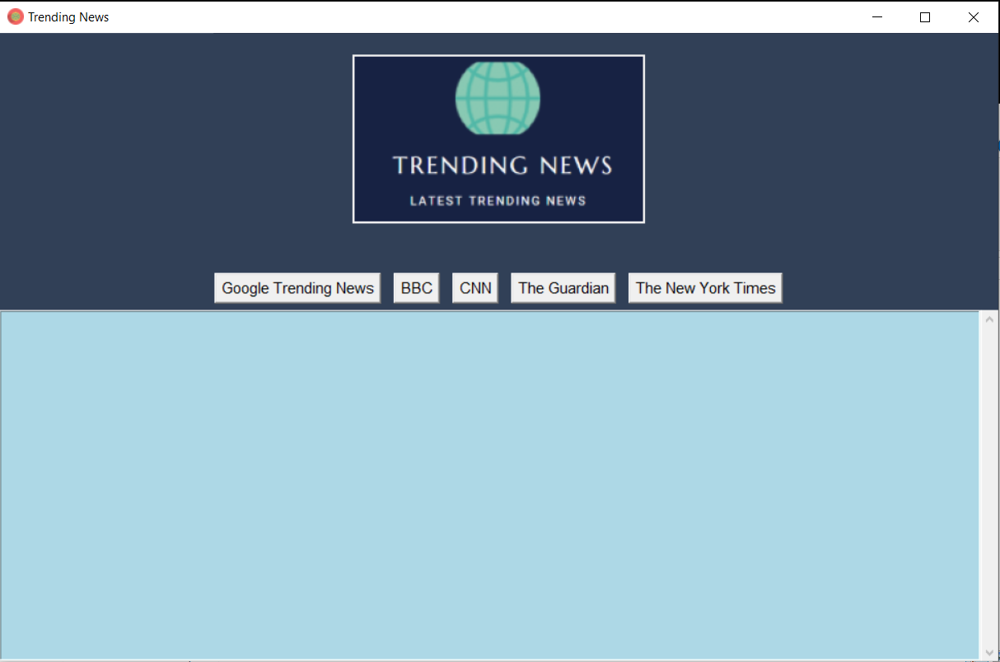

# Trending News App

A desktop app which collects news from Google trending news, BBC, CNN, The Guardian, and The New York Times using Python BeautifulSoup package.

Youtube link : https://youtu.be/XYIvXwmD0Ao
<br>
<table align="center">
    <tr>
        <td align="center">
         <p>Font View</p>
           
        </td>
    </tr>
</table>

## Dependencies:
  * import bs4
  * from bs4 import BeautifulSoup
  * import tkinter
  * from urllib.request import urlopen
  * from PIL import ImageTk,Image

### Usage:
  * ```$ python main.py``` or run START.bat  
  * To run main.exe, put main.exe in the `Trending-News-App` folder.
 
